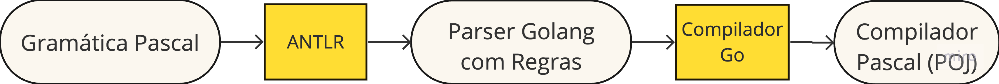

# Visão macro do projeto

Para simplificar a nossa solução vamos abstrair a geração do arquivo _class_ utilizando um montador [Java Assembly](https://www.eg.bucknell.edu/~cs360/java-assembler/examples.html) (Figura abaixo). Com isso o nosso compilador (POJ) será responsável por ler um programa contendo código Pascal e gerar o _assembly_ Java equivalente enquanto o montador será responsável por ler este _assembly_ e gerar o arquivo _class_ para ser executado na JVM.

E para facilitar o desenvolvimento do compilador vamos utilizar um [gerador de _parsers_](https://en.wikipedia.org/wiki/Compiler-compiler). O [ANTLR](https://www.antlr.org/), além de fornecer uma integração excelente entre a [análise léxica e sintática](https://www.scaler.com/topics/phases-of-compiler/), também utiliza [EBNF](https://en.wikipedia.org/wiki/Extended_Backus%E2%80%93Naur_form) para especificar a gramática da linguagem. Além disso, ANTLR gera código para diversas linguagens, entre elas Go :-)

A Figura abaixo contém as etapas necessárias para criarmos o nosso compilador (POJ). A partir da gramática da linguagem Pascal, o ANTLR gera o parser em Golang. A partir deste código Go gerado iremos instrumentar as regras necessárias, tanto na análise léxica bem como na sintática. Após isso utilizaremos o compilador do Go para gerar o binário do POJ.

# _Subset_ aceito

Quando falamos em _subset_ de Pascal entendam um programa Pascal válido, mas com um conjunto reduzido de instruções e operações:

- Declaração de variáveis utilizando os tipos básicos: integer, real, boolean e string;
- Estruturas condicionais: If/Else;
- Estruturas de repetição: For, While, Repeat;
- Entrada e saída de dados via console: Write, WriteLn, Read, ReadLn;
- Operações matemáticas com precedência de operadores: soma, subtração, divisão, multiplicação e módulo;
- Declaração de blocos de código: procedures e funções.

# Por que foi escolhida a JVM?

São 4 motivações:

- Documentação abundante.
- JVM já é utilizada por várias linguagens além do Java, como Clojure, Lisp, Scala e Kotlin, isso só citando algumas das mais conhecidas.
- JVM é uma [_stack based machine_](https://en.wikipedia.org/wiki/Stack_machine) o que simplifica (e muito) a geração do _bytecode_. Isso porque, além de necessitar de poucas operações, todas as operações da máquina virtual operam sobre a pilha. Já VMs [_register based_](https://en.wikipedia.org/wiki/Register_machine) necessitam de um conjunto maior de operações e precisam lidar com a alocação de registradores (mesmo que estes sejam virtuais). Para quem tiver interesse de ler mais sobre, [aqui](https://www.codeproject.com/Articles/461052/Stack-Based-vs-Register-Based-Virtual-Machine-Arch) tem uma publicação bem interessante sobre este tópico.
- Conhecimento prévio sobre o funcionamento da JVM.

Certamente outras VMs poderiam ter sido utilizadas (como a de Python, por exemplo). Mas no momento, a JVM é a melhor escolha.
